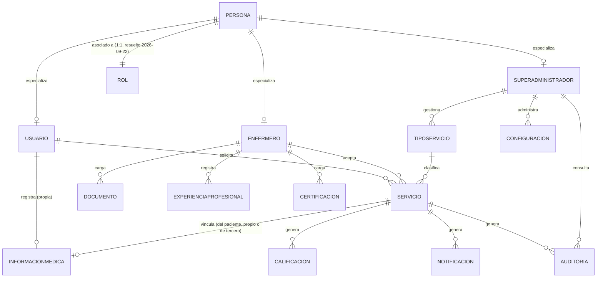

# Modelo de Dominio (Negocio) — AppEnfermeria

> Generado por Context Builder. Re-ejecutable. Última consolidación: 2026-09-29 (incluye resolución de CN-07 y del refinamiento de `Hallazgos-Auditoria-AppEnfermeria.md`, CN-10 en adelante, ver `business-rules-index.md`).
> Fuentes: `Requirements-Context.md` §3, §24, §25; `HU-01`, `HU-02`, `HU-03`, `HU-04`; `specs/context/vision.md`.
> Este modelo es de **negocio**, no técnico: no define tipos de dato, motor de base de datos ni claves. Esa traducción corresponde a Architecture Definer.

## 1. Entidades identificadas

Enumeradas explícitamente en `Requirements-Context.md` §24, con atributos consolidados desde el resto del documento y las HUs.

| Entidad                    | Atributos principales (nivel negocio)                                                                                                                                                                                              | Origen                                                     |
| -------------------------- | ---------------------------------------------------------------------------------------------------------------------------------------------------------------------------------------------------------------------------------- | ---------------------------------------------------------- |
| **Persona**                | Nombre completo, tipo de documento, número de documento, teléfono, correo electrónico, foto, zona de residencia (foto y zona movidas desde Enfermero el 2026-09-29, resolución INC-24)                                             | `Requirements-Context.md` §3.1                             |
| **Rol**                    | Nombre del rol (Usuario/Cliente, Enfermero, Superadministrador)                                                                                                                                                                    | `Requirements-Context.md` §2, §3.2                         |
| **Usuario**                | (hereda de Persona) + contraseña, estado de verificación de correo                                                                                                                                                                 | `Requirements-Context.md` §4; `HU-01`                      |
| **Enfermero**              | (hereda de Persona) + título profesional, tarjeta profesional, años de experiencia, estado de verificación (Pendiente de revisión / Aprobado / Corrección solicitada — unificado con "Rechazado" el 2026-09-29, resolución INC-16) | `Requirements-Context.md` §5; `HU-02`; `HU-03`             |
| **SuperAdministrador**     | (hereda de Persona)                                                                                                                                                                                                                | `Requirements-Context.md` §22                              |
| **TipoServicio**           | Identificador único, nombre, descripción, estado (Activo/Inactivo), fecha de creación, fecha de actualización                                                                                                                      | `Requirements-Context.md` §7; `HU-04`                      |
| **Servicio**               | Estado (Publicado/Asignado/En curso/Finalizado/Cancelado), tipo de servicio, fecha, hora de inicio, duración contratada, punto de origen, destino (cuando aplique), precio ofrecido, PIN asociado, hora de inicio efectivo         | `Requirements-Context.md` §8, §9, §14, §16                 |
| **InformacionMedica**      | Tipo de sangre, RH, información médica relevante (sin catálogo cerrado)                                                                                                                                                            | `Requirements-Context.md` §4.2; `HU-01`                    |
| **ExperienciaProfesional** | Años de experiencia, lugar de trabajo, descripción, documentos de respaldo                                                                                                                                                         | `Requirements-Context.md` §5.1; `HU-02`                    |
| **Documento**              | Tipo de documento (identidad, foto, título, tarjeta profesional, adicional), archivo                                                                                                                                               | `HU-02`                                                    |
| **Certificacion**          | Tipo de certificación, archivo/evidencia                                                                                                                                                                                           | `HU-02`                                                    |
| **Calificacion**           | Puntuación (0-5 estrellas), comentario opcional, autor (Usuario o Enfermero)                                                                                                                                                       | `Requirements-Context.md` §19                              |
| **Notificacion**           | Evento origen, destinatario, canal (no definido: in-app y/o correo)                                                                                                                                                                | `Requirements-Context.md` §24; `HU-03`                     |
| **Configuracion**          | Minutos de habilitación de datos sensibles, minutos de habilitación del PIN                                                                                                                                                        | `Requirements-Context.md` §13, §23                         |
| **Auditoria**              | Fecha y hora, usuario que realizó la acción, identificador del servicio/entidad afectada, estado anterior, estado nuevo, información relevante de la operación                                                                     | `Requirements-Context.md` §20.5 ("Auditoría del servicio") |

## 2. Relaciones principales

Consolidadas desde `Requirements-Context.md` §25 y el modelo propuesto en `HU-04`.

| Entidad origen | Relación                                                             | Entidad destino        | Notas                                                                                                                                                                                                                                                                                                                |
| -------------- | -------------------------------------------------------------------- | ---------------------- | -------------------------------------------------------------------------------------------------------------------------------------------------------------------------------------------------------------------------------------------------------------------------------------------------------------------- |
| Persona        | 1:1 (resuelto el 2026-09-22, ver CN-07 en `business-rules-index.md`) | Rol                    | Una persona tiene un único rol en el MVP; no puede registrarse bajo más de un rol.                                                                                                                                                                                                                                   |
| Persona        | 1:1 (por especialización)                                            | Usuario                | Un perfil de Usuario por Persona                                                                                                                                                                                                                                                                                     |
| Persona        | 1:1 (por especialización)                                            | Enfermero              | Un perfil de Enfermero por Persona                                                                                                                                                                                                                                                                                   |
| Persona        | 1:1 (por especialización)                                            | SuperAdministrador     | Un perfil de SuperAdministrador por Persona                                                                                                                                                                                                                                                                          |
| TipoServicio   | 1:N                                                                  | Servicio               | Un tipo de servicio puede estar asociado a múltiples servicios; cada servicio tiene un único tipo (`HU-04`, sección "Consideraciones de modelo de datos")                                                                                                                                                            |
| Usuario        | 1:N                                                                  | Servicio               | Un usuario puede solicitar múltiples servicios (futuro, HU-05+)                                                                                                                                                                                                                                                      |
| Enfermero      | 1:N                                                                  | Servicio               | Un enfermero puede aceptar múltiples servicios a lo largo del tiempo. `CTX-RN-01` solo garantiza que cada Servicio tenga un único Enfermero asignado; no existe (todavía) una regla que impida que un mismo Enfermero acepte servicios con horarios solapados — ver INC-20 en `Hallazgos-Auditoria-AppEnfermeria.md` |
| Servicio       | 1:N                                                                  | Calificacion           | Cada servicio finalizado genera dos calificaciones (una por parte)                                                                                                                                                                                                                                                   |
| Servicio       | 1:N                                                                  | Notificacion           | Eventos del servicio generan notificaciones                                                                                                                                                                                                                                                                          |
| Servicio       | 1:N                                                                  | Auditoria              | Cada evento relevante del servicio genera un registro de auditoría                                                                                                                                                                                                                                                   |
| Enfermero      | 1:N                                                                  | Documento              | Documentos obligatorios y opcionales del perfil                                                                                                                                                                                                                                                                      |
| Enfermero      | 1:N                                                                  | ExperienciaProfesional | Registros de experiencia laboral                                                                                                                                                                                                                                                                                     |
| Enfermero      | 1:N                                                                  | Certificacion          | Certificaciones opcionales                                                                                                                                                                                                                                                                                           |
| Usuario        | 0:1                                                                  | InformacionMedica      | Datos médicos propios, capturados durante el registro (`HU-01`)                                                                                                                                                                                                                                                      |

## 3. Diagrama de alto nivel

## 4. Notas de modelado abiertas

- La cardinalidad `Persona ↔ Rol` se resolvió el 2026-09-22 como **1:1**: una misma Persona no puede registrarse bajo más de un Rol en el MVP (decisión del developer, ver `business-rules-index.md` § Contradicciones resueltas, CN-07). Si en el futuro se requiere que una persona actúe bajo más de un rol, será una decisión de producto explícita a revisar con Architecture Definer.
- `InformacionMedica` puede corresponder al Usuario mismo o a un tercero para quien se solicita el servicio (`Requirements-Context.md` §4.2), pero no existe todavía una entidad o regla que modele formalmente a ese tercero como titular de datos.
- El PIN se describe como un atributo del Servicio, no como una entidad propia; se mantiene así en este modelo de negocio.
- **Vacío detectado (INC-20, auditoría 2026-09-29):** ninguna regla del corpus impide que un mismo Enfermero acepte dos o más servicios con horarios solapados. `CTX-RN-01` solo exige que un Servicio tenga un único Enfermero, no que un Enfermero tenga un único servicio activo. Queda como vacío para `User Story Completer`.
- **MVP ampliado (resolución INC-01, 2026-09-29):** `specs/context/vision.md` §5 confirma para el MVP verificación de identidad facial del enfermero, pasarela de pagos, negociación de precio, directorio con invitación directa y ubicación en tiempo real + contacto de emergencia. Ninguna de estas funcionalidades tiene todavía entidades ni atributos en este modelo (p. ej. no existe `ContactoEmergencia`, ni un atributo de geolocalización en `Enfermero`, ni un estado de verificación biométrica). Se registra aquí como vacío de modelado — su diseño concreto corresponde a `User Story Completer` (nuevas HU) y `Architecture Definer` (traducción técnica), no a este documento de consolidación.
